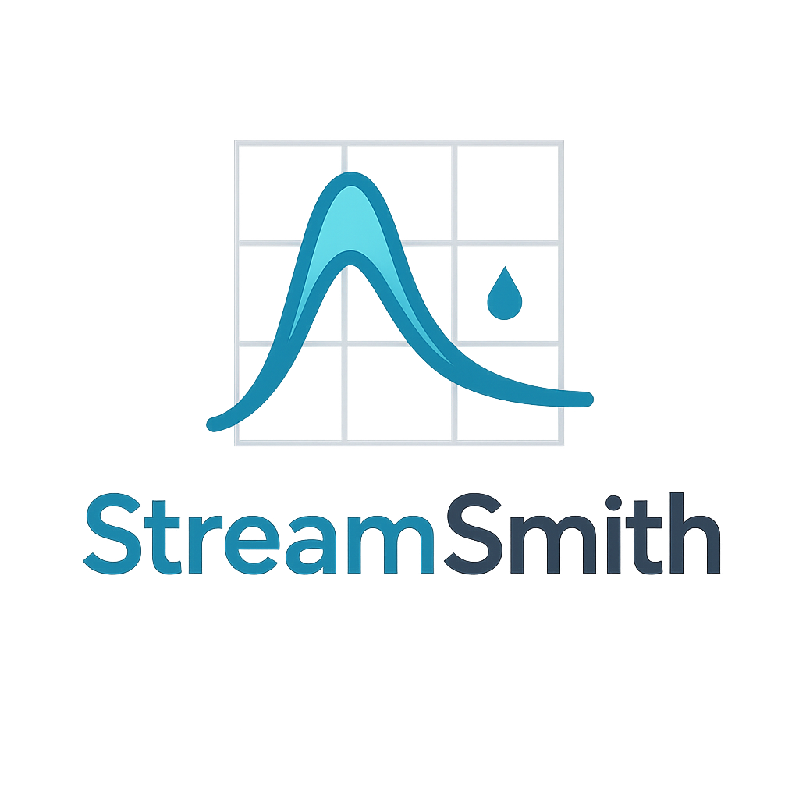

<p align="center">
  
</p>

# StreamSmith

StreamSmith is a Streamlit-based web application for hydrologists, engineers, and educators to generate and analyze **Normalized Unit Hydrographs (NUH)** using USGS streamflow data.

---

## 🚀 Features

- 📥 Download discharge data from USGS NWIS
- 📊 Detect and filter streamflow peaks
- 📈 Visualize hydrographs and peak flow events
- 🧮 Create and export smoothed & normalized unit hydrographs
- 📁 Save hydrograph events and DUHs in organized folders
- ✨ Pixi environment support for reproducible installs

---

## 🎥 What It Does (Demo Video)

📺 *Watch a quick demo of StreamSmith in action:*  

[](https://youtu.be/j-TWeX9TdM8?si=hdp8Zt371DRq3kdQ)

---


## ⚙️ Installation

This app uses [Pixi](https://pixi.sh/latest/) for environment management.

1. To install pixi you can run the following command in your Windows PowerShell terminal:
   ```bash
   powershell -ExecutionPolicy ByPass -c "irm -useb https://pixi.sh/install.ps1 | iex"
   ```
The above invocation will automatically download the latest version of pixi, extract it, and move the pixi binary to LocalAppData/pixi/bin. The command will also add LocalAppData/pixi/bin to your PATH environment variable, allowing you to invoke pixi from anywhere.


2. Navigate to the NUH project folder and install dependencies:
   ```bash
   cd "C:\...\Project Folder (StreamSmith-main)"
   ```

   ```bash
   pixi install
   ```

---

## ▶️ Launching the App

After installation, run the app with:

```bash
pixi run streamlit run NormalizedHydrographGenerator.py --server.port 8502
```

---

## 🛠️ Installation Guide (Video)

💡 *Need help getting started? Follow this installation tutorial:*  

[](https://youtu.be/7s881nEHuko?si=CViCl8uZcA11IbRe)

---


## 📁 Project Structure

```
StreamSmith/
├── app/
│   ├── data_io.py
│   ├── helpers.py
│   ├── peak_detection.py
│   ├── plotting.py
│   └── smoothing.py
├── Images/
│   └── Logo.png
├── NormalizedHydrographGenerator.py
├── launch_gui.py
├── README.md
├── pixi.toml
├── pixi.lock

```
---

## 📦 Example Use Cases

- Analyze seasonal flood events from historical streamflow records.
- Generate normalized hydrographs for rainfall-runoff modeling.
- Study regional differences in stormflow responses.
- Support academic research and watershed planning workflows.

---

## 🤝 Contributing

Feel free to fork the repo and submit pull requests. Open an issue if you spot bugs or want to suggest features!

---

**Developed by:** Mohsen Tahmasebi Nasab, PhD  
🌐 [hydromohsen.com](https://www.hydromohsen.com)


---

## 📄 License

Custom Open-Source License

Copyright (c) 2024 Mohsen Tahmasebi Nasab

Permission is hereby granted, free of charge, to any person obtaining a copy of this software and associated documentation files (the “Software”), to use, copy, and modify the Software for personal, academic, or internal non-commercial purposes, subject to the following conditions:

1. Commercial use, including but not limited to use in paid services, proprietary software, or as part of any commercial product or package, is not permitted without prior written permission from the copyright holder.

2. Redistribution of the Software, in part or in full, whether modified or unmodified, is also not permitted without prior written permission.

3. This copyright notice and license shall be included in all copies or substantial portions of the Software.

## Disclaimer
The software is provided "as is", without warranty of any kind, express or implied, including but not limited to the warranties of merchantability, fitness for a particular purpose, and non-infringement. In no event shall the author or copyright holder be liable for any claim, damages, or other liability, whether in an action of contract, tort, or otherwise, arising from, out of, or in connection with the software or the use or other dealings in the software, including but not limited to any direct, indirect, incidental, special, exemplary, or consequential damages.

---

